# Document Builder: Integrating 10 Design Patterns
**Duration**: 10 Minutes
**Goal**: Demonstrate how 10 classic Design Patterns naturally fit together in a Document Builder application.

---

## Slide 1: Introduction to the App and Demo
**Title**: Building a Flexible Document Editor
**Content**:
- **What**: A Document Builder application supporting text, images, tables, styling, and exports.
- **Why**: Software design gets messy. Design Patterns solve common pain points elegantly.
- **The Demo**: We will walk through the core domain, each specific pattern, and finish with a live demonstration.

---

## Slide 2: Core Domain Classes
**Title**: The Foundation of Our App
**Content**:
- A `Document` holds a list of `Element` objects, representing the core domain without any complex behaviors yet.
- **Relevant Files**: 
  - [Document.java](src/main/java/com/glproject/domain/Document.java)
  - [Element.java](src/main/java/com/glproject/domain/Element.java)

**Diagram**:
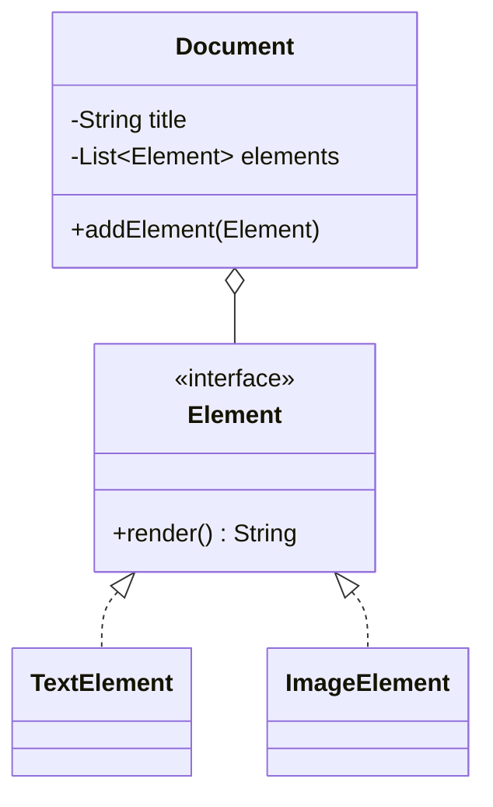

---

## Slide 3: Singleton Pattern
**Title**: Creational - Global State Control
**Content**:
- **Purpose**: Ensures a class has only one instance and provides a global point of access to it.
- **Usage**: Global `Configuration` and `Logger`.
- **Relevant Files**: 
  - [Logger.java](src/main/java/com/glproject/util/Logger.java)
  - [Configuration.java](src/main/java/com/glproject/util/Configuration.java)

**Diagram**:
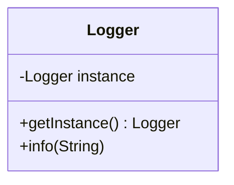

**Code snippet**:
```java
Logger logger = Logger.getInstance();
logger.info("Starting App...");
Configuration config = Configuration.getInstance();
```

---

## Slide 4: Factory Method Pattern
**Title**: Creational - Standardizing Instantiation
**Content**:
- **Purpose**: Defines an interface for creating an object, but let subclasses decide which class to instantiate.
- **Usage**: Instantiating different elements via a single factory.
- **Relevant Files**: 
  - [ElementFactory.java](src/main/java/com/glproject/creational/ElementFactory.java)
  - [TextElementFactory.java](src/main/java/com/glproject/creational/TextElementFactory.java)

**Diagram**:
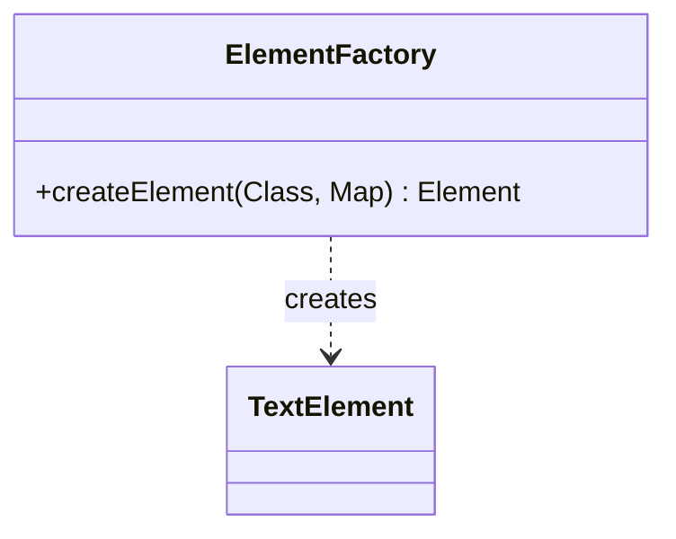

**Code snippet**:
```java
Element text = ElementFactory.createElement(
    TextElement.class, Map.of("content", "Paragraph")
);
```

---

## Slide 5: Builder Pattern
**Title**: Creational - Step-by-Step Construction
**Content**:
- **Purpose**: Separates the construction of a complex object from its representation.
- **Usage**: Constructing `Document` objects fluently without telescoping constructors.
- **Relevant Files**: 
  - [DocumentBuilder.java](src/main/java/com/glproject/creational/DocumentBuilder.java)

**Diagram**:
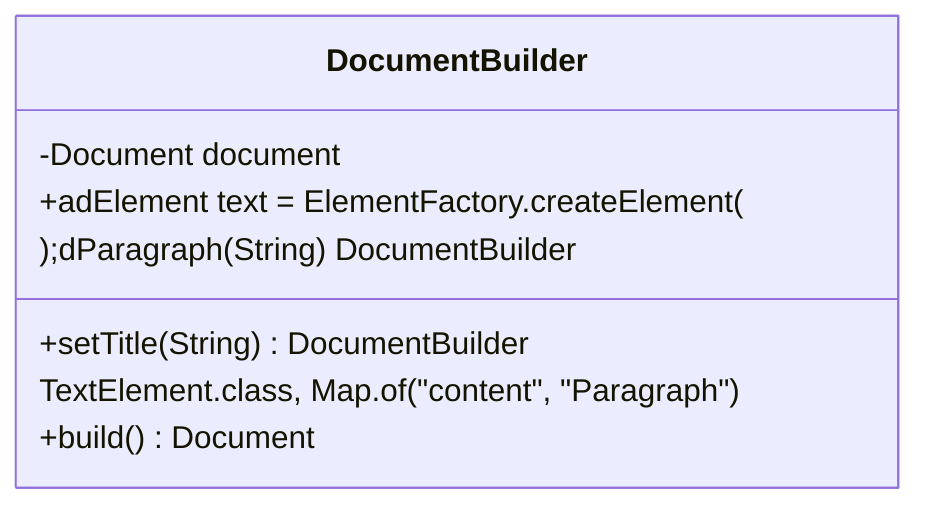

**Code snippet**:
```java
Document doc = new DocumentBuilder()
    .setTitle("Demo")
    .addParagraph("10 Patterns Demo")
    .build();
```

---

## Slide 6: Decorator Pattern
**Title**: Structural - Dynamic Styling
**Content**:
- **Purpose**: Attach additional responsibilities to an object dynamically.
- **Usage**: Adding bold, italic, or color styling to an `Element`.
- **Relevant Files**: 
  - [ElementDecorator.java](src/main/java/com/glproject/structural/ElementDecorator.java)
  - [BoldDecorator.java](src/main/java/com/glproject/structural/BoldDecorator.java)

**Diagram**:
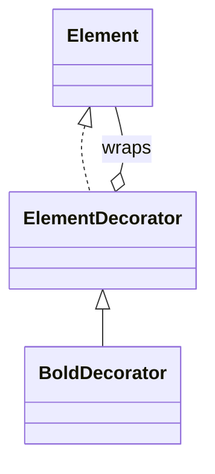

**Code snippet**:
```java
Element plain = new TextElement("Important");
Element boldStyled = new ColorDecorator(new BoldDecorator(plain), "red");
```

---

## Slide 7: Adapter Pattern
**Title**: Structural - Interface Compatibility
**Content**:
- **Purpose**: Convert the interface of a class into another client-expected interface.
- **Usage**: Wrapping a rigid 3rd-party PDF library to match our `PDFBuilder` interface.
- **Relevant Files**: 
  - [PDFLibraryAdapter.java](src/main/java/com/glproject/structural/PDFLibraryAdapter.java)
  - [PDFBuilder.java](src/main/java/com/glproject/structural/PDFBuilder.java)

**Diagram**:
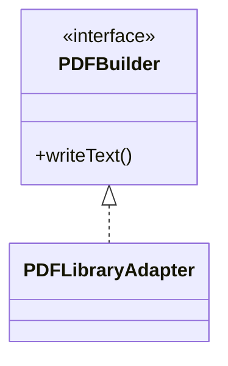

**Code snippet**:
```java
PDFBuilder pdfBuilder = new PDFLibraryAdapter();
pdfBuilder.writeText("Adapted legacy code", 50, 50);
```

---

## Slide 8: Facade Pattern
**Title**: Structural - Simplifying Complexity
**Content**:
- **Purpose**: Provide a unified interface to a set of interfaces in a subsystem.
- **Usage**: Hiding the multi-step export logic.
- **Relevant Files**: 
  - [DocumentExporterFacade.java](src/main/java/com/glproject/facade/DocumentExporterFacade.java)

**Diagram**:
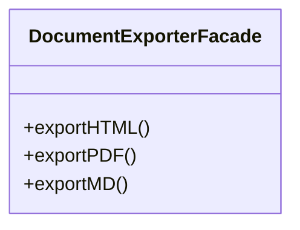

**Code snippet**:
```java
DocumentExporterFacade facade = new DocumentExporterFacade();
facade.exportHTML(doc, "demo.html");
```

---

## Slide 9: Strategy Pattern
**Title**: Behavioral - Interchangeable Algorithms
**Content**:
- **Purpose**: Define a family of algorithms, encapsulate each one, and make them interchangeable.
- **Usage**: Swapping out `PDFExportStrategy` vs `MarkdownExportStrategy`.
- **Relevant Files**: 
  - [ExportStrategy.java](src/main/java/com/glproject/behavioral/ExportStrategy.java)
  - [MarkdownExportStrategy.java](src/main/java/com/glproject/behavioral/MarkdownExportStrategy.java)

**Diagram**:
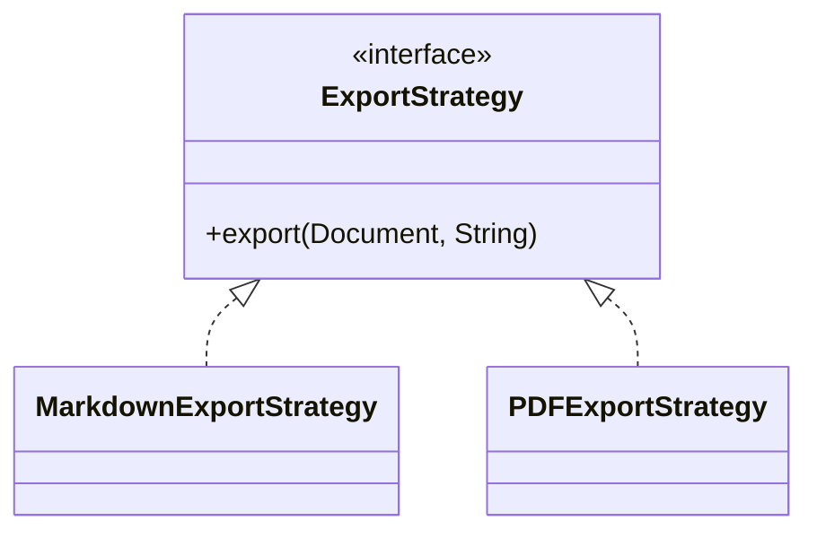

**Code snippet**:
```java
facade.export(doc, "demo.md", new MarkdownExportStrategy());
```

---

## Slide 10: Observer Pattern
**Title**: Behavioral - Decoupled Reactions
**Content**:
- **Purpose**: A one-to-many dependency where state changes notify dependents.
- **Usage**: Informing the terminal/logs when the document is manipulated.
- **Relevant Files**: 
  - [DocumentEventBus.java](src/main/java/com/glproject/behavioral/DocumentEventBus.java)
  - [ConsoleObserver.java](src/main/java/com/glproject/behavioral/ConsoleObserver.java)

**Diagram**:
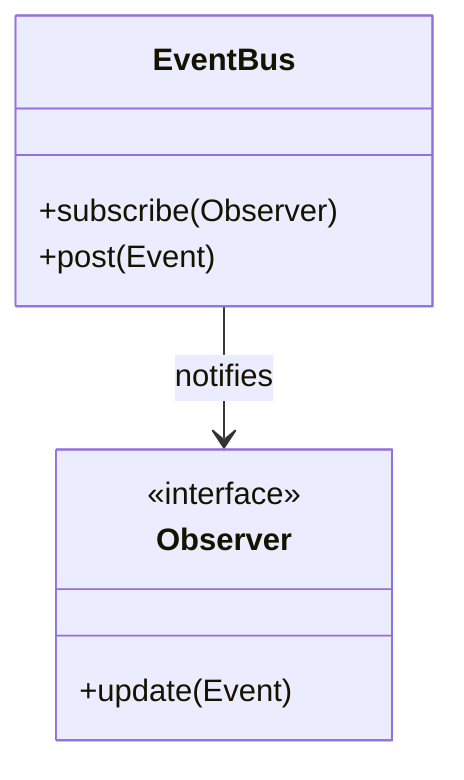

**Code snippet**:
```java
doc.getEventBus().subscribe(new ConsoleObserver());
doc.addElement(new TextElement("Sends an event automatically"));
```

---

## Slide 11: Command Pattern
**Title**: Behavioral - Encapsulated Requests
**Content**:
- **Purpose**: Encapsulate a request as an object, allowing for queueing and undoable operations.
- **Usage**: Reverting document modifications cleanly.
- **Relevant Files**: 
  - [Command.java](src/main/java/com/glproject/behavioral/Command.java)
  - [CommandHistory.java](src/main/java/com/glproject/behavioral/CommandHistory.java)
  - [AddElementCommand.java](src/main/java/com/glproject/behavioral/AddElementCommand.java)

**Diagram**:
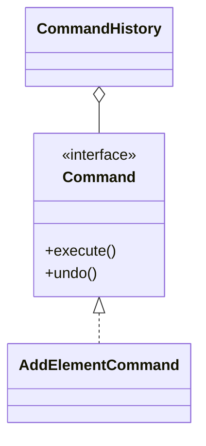

**Code snippet**:
```java
CommandHistory history = new CommandHistory();
Command addCmd = new AddElementCommand(doc, new TextElement("Undo me"));
history.executeCommand(addCmd); 
history.undo(); 
```

---

## Slide 12: Iterator Pattern
**Title**: Behavioral - Safe Traversal
**Content**:
- **Purpose**: Provide a way to access the elements of an aggregate object sequentially without exposing its underlying representation.
- **Usage**: Scanning all elements in the document, or filtering specifically for text elements.
- **Relevant Files**: 
  - [DocumentIterator.java](src/main/java/com/glproject/behavioral/DocumentIterator.java)
  - [ElementTypeFilter.java](src/main/java/com/glproject/behavioral/ElementTypeFilter.java)

**Diagram**:
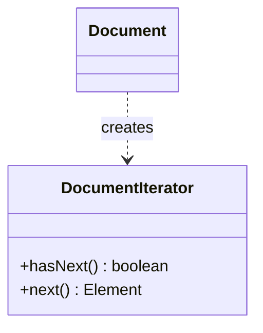

**Code snippet**:
```java
DocumentIterator textIt = doc.iterator(ElementTypeFilter.textOnly());
while (textIt.hasNext()) {
    System.out.println(textIt.next().render());
}
```

---

## Slide 13: Live Demo
**Title**: Bringing It All Together
**Content**:
- We will now run `Main.java`.
- **Relevant File**: 
  - [Main.java](src/main/java/com/glproject/Main.java)
- Observe terminal outputs demonstrating the creation, decoration, logic events, and undo features.
- Inspect the generated `.html`, `.md`, and `.pdf` files in the `output/` directory.

---

## Slide 14: Conclusion
**Title**: Summary
**Content**:
- **Core Domain**: Simple and decoupled interface-driven models.
- **Creational**: Safe instance management and object construction.
- **Structural**: Flexible class hierarchies and simplified APIs.
- **Behavioral**: Dynamic interactions, interchangeable algorithms, and feature-rich states.
- **Result**: A highly maintainable, extensible project architecture.

**Any Questions?**
